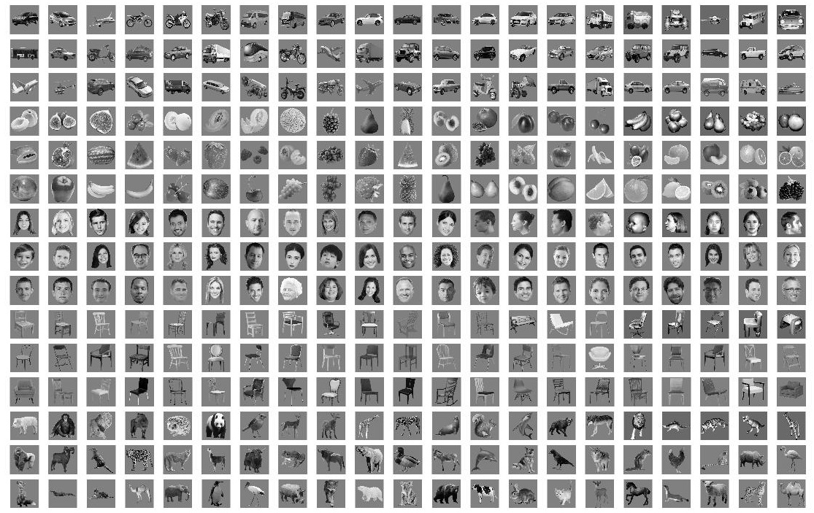
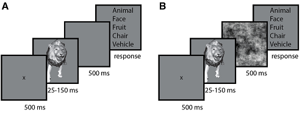
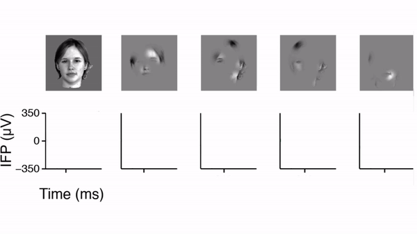

# Recurrent computations for visual pattern completion

Hanlin Tang*, Martin Schrimpf*, William Lotter*, Charlotte Moerman, Ana Paredes, Josue Ortega Caro, Walter Hardesty, David Cox, Gabriel Kreiman

<details><summary>Proceedings of the National Academy of Sciences (PNAS) Aug 2018, 201719397; DOI: 10.1073/pnas.1719397115</summary><p>

```
  @article{TangSchrimpfLotter2018,
	author = {Tang, Hanlin and Schrimpf, Martin and Lotter, William and Moerman, Charlotte and Paredes, Ana and Ortega Caro, Josue and Hardesty, Walter and Cox, David and Kreiman, Gabriel},
	title = {Recurrent computations for visual pattern completion},
	year = {2018},
	doi = {10.1073/pnas.1719397115},
	publisher = {National Academy of Sciences},
	abstract = {The ability to complete patterns and interpret partial information is a central property of intelligence. Deep convolutional network architectures have proved successful in labeling whole objects in images and capturing the initial 150 ms of processing along the ventral visual cortex. This study shows that human object recognition abilities remain robust when only small amounts of information are available due to heavy occlusion, but the performance of bottom-up computational models is impaired under limited visibility. The results provide combined behavioral, neurophysiological, and modeling insights showing how recurrent computations may help the brain solve the fundamental challenge of pattern completion.Making inferences from partial information constitutes a critical aspect of cognition. During visual perception, pattern completion enables recognition of poorly visible or occluded objects. We combined psychophysics, physiology, and computational models to test the hypothesis that pattern completion is implemented by recurrent computations and present three pieces of evidence that are consistent with this hypothesis. First, subjects robustly recognized objects even when they were rendered \&lt;15\% visible, but recognition was largely impaired when processing was interrupted by backward masking. Second, invasive physiological responses along the human ventral cortex exhibited visually selective responses to partially visible objects that were delayed compared with whole objects, suggesting the need for additional computations. These physiological delays were correlated with the effects of backward masking. Third, state-of-the-art feed-forward computational architectures were not robust to partial visibility. However, recognition performance was recovered when the model was augmented with attractor-based recurrent connectivity. The recurrent model was able to predict which images of heavily occluded objects were easier or harder for humans to recognize, could capture the effect of introducing a backward mask on recognition behavior, and was consistent with the physiological delays along the human ventral visual stream. These results provide a strong argument of plausibility for the role of recurrent computations in making visual inferences from partial information.},
	issn = {0027-8424},
	URL = {http://www.pnas.org/content/early/2018/08/07/1719397115},
	eprint = {http://www.pnas.org/content/early/2018/08/07/1719397115.full.pdf},
	journal = {Proceedings of the National Academy of Sciences}
}
```
</p></details>

http://www.pnas.org/content/early/2018/08/07/1719397115/


## Data
All the data can be found on this webpage: http://klab.tch.harvard.edu/resources/Tangetal_RecurrentComputations.html

### Stimuli
http://klab.tch.harvard.edu/resources/Tangetal_RecurrentComputations.html#stimuli


### Behavioral data
http://klab.tch.harvard.edu/resources/Tangetal_RecurrentComputations.html#psychophysics


Humans are robust at recognizing even highly occluded objects; 
but their recognition is severely impaired through backward masking.

### Neurophysiological data
http://klab.tch.harvard.edu/resources/Tangetal_RecurrentComputations.html#neurophysiology


Decoding object identity from human cortex is delayed when images are occluded.
These delays are correlated with the behavioral effect of backward masking.

### Additional figures
http://klab.tch.harvard.edu/resources/Tangetal_RecurrentComputations/WebFigures.pdf

## Models
All encoding models can be found here: https://github.com/kreimanlab/occlusion-models/tree/master/feature_extractors
Models are trained only on whole images and tested on occluded ones, posing a strong test of invariance.

The Hopfield network is implemented here: https://github.com/kreimanlab/occlusion-models/blob/master/feature_extractors/hopfield/HopFeatures.m


Over time, the occluded representations converge towards their whole attractors (and in some cases, towards sparse states).
The above video shows a sample of 300 occluded images converging towards attractors.

### Setup
Clone this repository, making sure to also pull the models submodule:
`git clone --recurse-submodules https://github.com/kreimanlab/occlusion-classification.git`

You will need MATLAB, we used version R2016a.

To run everything, you will also need datasets which are too big for Github and can be found here: http://klab.tch.harvard.edu/resources/Tangetal_RecurrentComputations.html

### Sample runs
Creating inception features:
```bash
./run.sh rnn \
    "--model inceptionv3 
    --num_epochs 0 
    --features_directory ~/group/features/ 
    --input_features data_occlusion_klab325v2/images.mat 
    --whole_features klab325_orig/images.mat  
    --cross_validation objects 
    --num_timesteps 1"
```

Re-training Caffenet and creating features:
```bash
./run.sh rnn \
    "--model caffenet 
    --num_epochs 100  
    --features_directory ~/group/features/  
    --input_features data_occlusion_klab325v2/images.mat  
    --target_features data_occlusion_klab325v2/labels.mat  
    --whole_features klab325_orig/images.mat  
    --cross_validation objects"
```

Creating Hopfield features:
```bash
./run.sh features-hop \
    "'featureExtractors', NamedFeatures('resnet50'), 
    'trainDirectory', '~/group/features/klab325_orig/', 
    'testDirectory', '~/group/features/data_occlusion_klab325v2/', 
    'dataset', loadData('data/data_occlusion_klab325v2.mat', 'data')"
```

Training and predicting with SVM based on less-occlusion features:
```bash
./run.sh classification \
    "'featureExtractors', {NamedFeatures('features-inceptionv3_objects-t0')}, 
    'trainDirectory', '~/group/features/klab325_orig/', 
    'testDirectory', '~/group/features/data_occlusion_klab325v2'"
```

Plotting results:
```MATLAB
load('results.mat');
displayResults(results);
```
Plotting results with non-standard experimentData (usually data_occlusion_klab325v2.mat):
```MATLAB
load('results.mat');
load('experimentData.mat');
displayResults(results, data);
```


### Troubleshooting
#### libsvm compilation fails on Linux
To resolve the error 
`cc1plus: error: unrecognized command line option "-std=c++11"`
when compiling libsvm inside Matlab, 
compile outside Matlab by typing `make matlab`.
